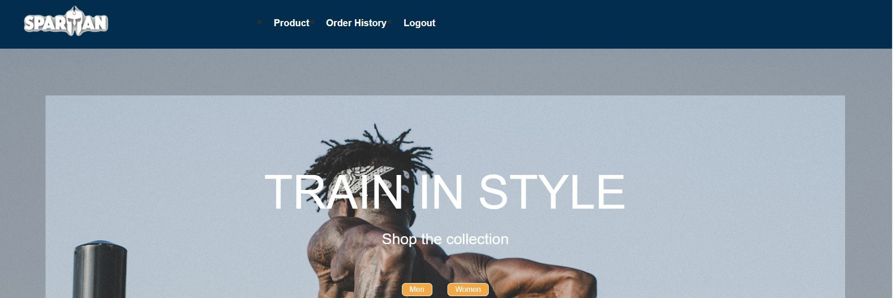

# Spartan Clothing

## Description
An E-commerce application that offers fitness clothing for men and women. The website allows users to login, add items to cart, and checkout using Stripe.

Link to deployed application:



## User Story
```
AS a user I WANT to shop on a  website that is easy to use,  secure,  and appealing 
SO THAT I can safely purchase products.

```

## Technologies Used
* React, react-dom-router				 
* GraphQL 
* Node.js
* Express.js 
* Heroku 
* JWT 
* Bcrypt	
* Apollo 	
* Stripe	
* MongoDB

## Directions for Future Development
* More product lines such as accessories and fitness gear
* Add more options under the two men and women categories
* Add a “Top Picks” page that  displays merchandise     picked by the featured athletes
* Supporters suggestions
* Live Chat Box where customers can interact with a live member


## Contributors
* Mohammad Javid Moradi
* Maria Cowdrey
* Raymond Walker
* Irvin Chao
